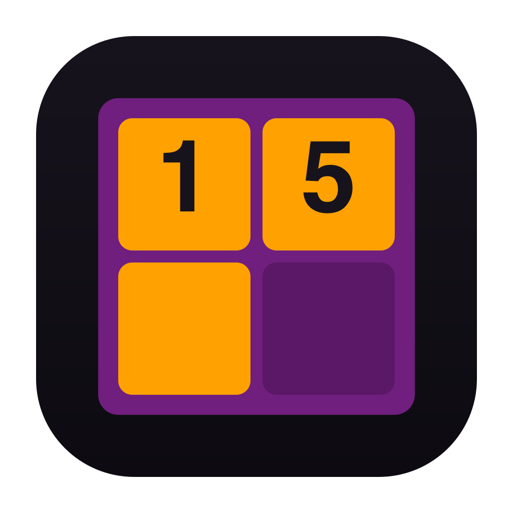
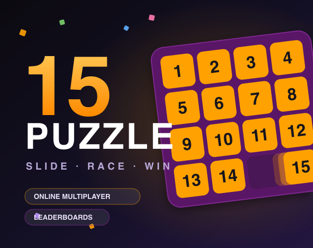
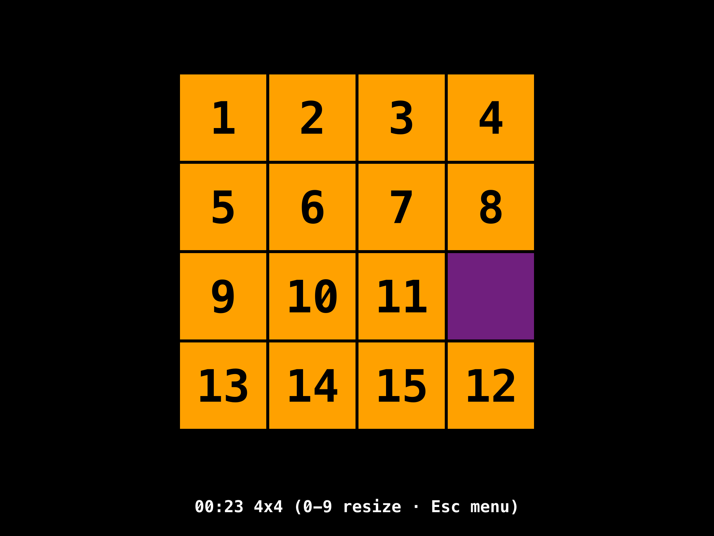
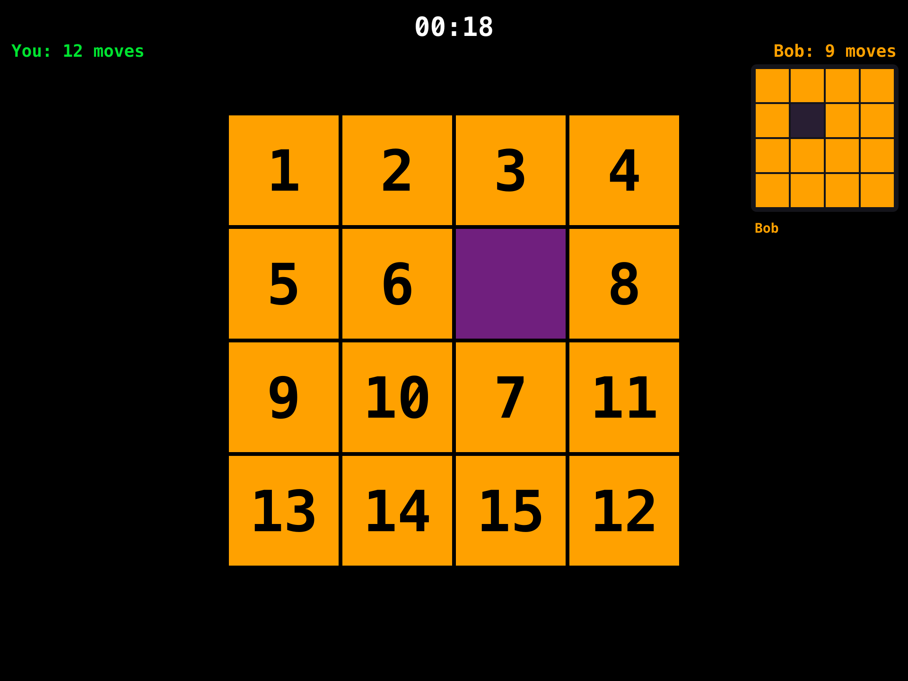
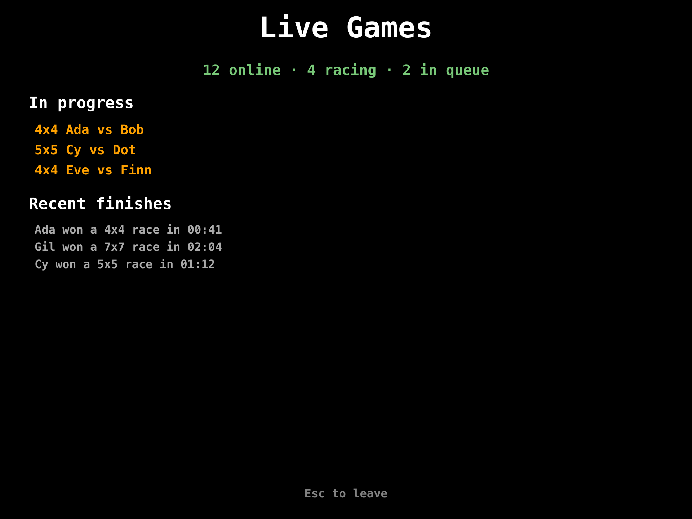
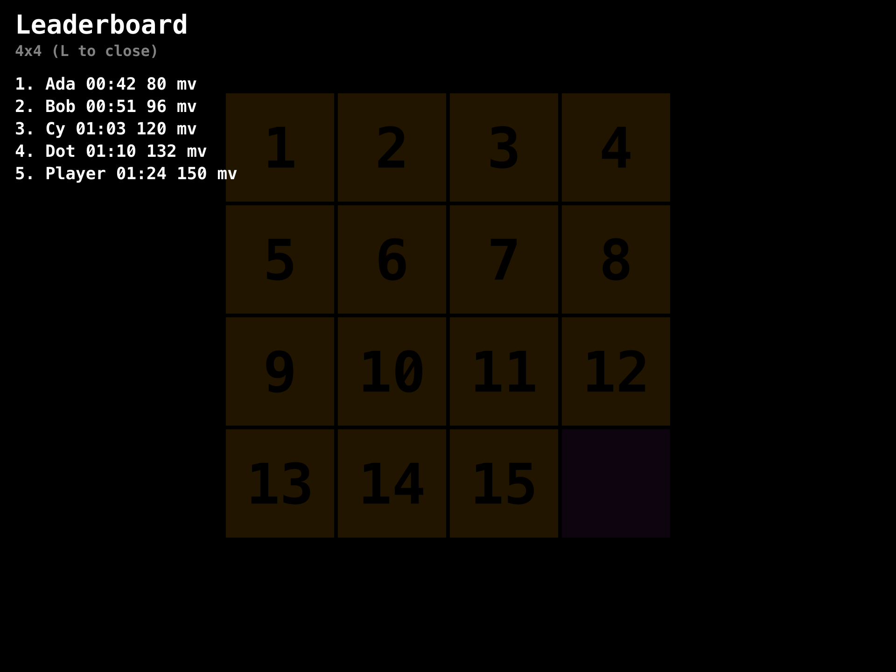
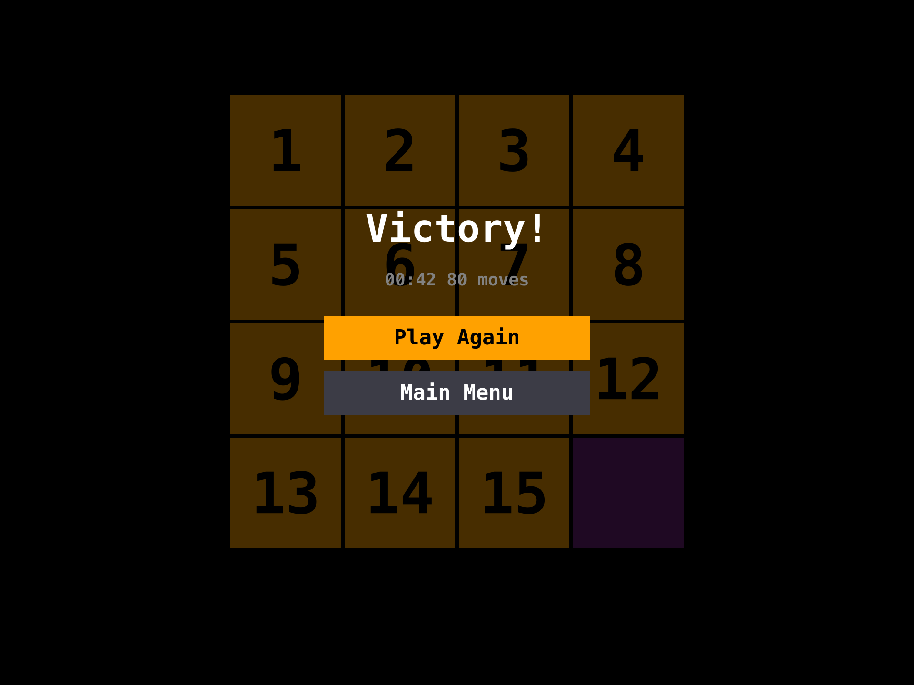

# 15 Puzzle

[](https://github.com/jaroshevskii/fifteen-puzzle/actions/workflows/macos.yml)
[](https://github.com/jaroshevskii/fifteen-puzzle/actions/workflows/linux.yml)
[](https://github.com/jaroshevskii/fifteen-puzzle/actions/workflows/windows.yml)
[](https://github.com/jaroshevskii/fifteen-puzzle/actions/workflows/format.yml)
[](https://github.com/jaroshevskii/fifteen-puzzle/actions/workflows/release.yml)

A implementation of the classic 15 Puzzle built with C++ and raylib — organized
as a **client + server monorepo** in the style of [isowords][isowords]: one
repository, one build, with the game, the backend (`FifteenServer`) and the
modules they share (game rules, API routes, the multiplayer protocol) defined
once and imported by both sides.



## Screenshots

<p align="center">
  
  
</p>
<p align="center">
  
  
</p>
<p align="center">
  
</p>

*(UI renders, faithful to the game — sources in `Bootstrap/`: [icon.svg](Bootstrap/icon.svg), [cover.svg](Bootstrap/cover.svg), and `make-screenshots.py`.)*

## Demo

https://github.com/user-attachments/assets/27aa40b4-fad5-4d7b-8968-d04e3f46d064

## Overview

This project implements:

- 4×4 sliding puzzle grid
- Mouse and keyboard interaction
- Solvable shuffle logic
- Win state detection
- Elapsed/victory timer with optional tick sound
- Online leaderboard served by the bundled `FifteenServer`
- Realtime head-to-head **multiplayer** (race an opponent on the same board,
  with the server as referee)

## Architecture

The app is built on a C++ port of [the Composable Architecture (TCA) **2.0**][tca]
and the [Dependencies][deps] library, following the modular, feature-per-library
structure of [isowords][isowords]. The 2.0 concepts and naming are carried over
faithfully to C++:

| TCA 2.0 concept | C++ port |
| --- | --- |
| Feature definition | `ComposableArchitecture::Feature<State, Action>` (a `body()`) |
| Synchronous state mutation | `Update { state, action, store in … }` (no effect returns) |
| Implicit feature store | `Store<State, Action>` — `addTask`, `send`, `modify`, `snapshot` |
| Async work on a background task | `store.addTask([](store, stop){ … }, cancelID)` |
| Lifecycle hooks | `.onMount(...)`, `.onDismount(...)` |
| Composition | `Scope(&State::child, casePath, Child::body())` |
| Controlled dependencies | `Dependency<Key>`, `DependencyValues`, `withDependencies`, `prepareDependencies` |
| Exhaustive feature testing | `TestStore<State, Action>` |

State is mutated only on the store's thread: `Update` blocks mutate synchronously,
and async work enqueued with `store.addTask` reports back via `store.send` /
`store.modify` (serialized on the main thread, so feature code has no locks or
data races). There are no `Effect` return values — the 2.0 redesign. The first
shuffle and timer start happen in **`onMount`**, not an `AppLaunched` action.
Time (`\.date`) and randomness (`\.withRandomNumberGenerator`) flow through
controlled dependencies, so the puzzle logic is fully deterministic under test.
Audio is an injected `AudioPlayerClient` (interface + live OpenAL backend), wired
in at launch via `prepareDependencies`.

*Not ported (2.0 features that don't fit a small raylib game): SwiftUI bindings,
preferences, triggers, delegate closures, `spawn`, `@FeatureLocal`, events, and
full `@MainActor` actor isolation (we use a single-threaded loop with a
main-thread-guarded store instead).*

**Modern-TCA checklist** the features are held to (and re-validated as of the
multiplayer work):

- Actions named literally after what happened — user intent (`TileTapped`,
  `RematchTapped`) or effect payloads (`SolverSucceeded`, `RemoteResponse`,
  `ClientEvent`) — never imperative commands.
- Every effect reports back through an action; background tasks touch state
  only via `store.send`/`store.modify`. Long-running effects have cancellation
  ids (`"auto-solve"`, `"leaderboard-remote"`, `"multiplayer-connection"`).
- All I/O and nondeterminism behind `Dependency` keys (date, RNG, audio,
  solver, database, API, multiplayer connection); features never reach for the
  wall clock or a raw socket. The `GameServer` engine draws its seeds and
  timestamps through the same keys, so server tests pin them too.
- State-driven navigation with an enum `Destination` (`ifCaseLet` +
  `caseState`); presentation lifecycle is the parent's job — present the case,
  then dispatch the child's `Appeared` (Leaderboard, Multiplayer and Live).
- Declarative edge detection with the **`onChange` trigger** (a TCA-2.0 port
  added to `Feature`): the win handler fires on `puzzle.isGameOver` flipping
  true, replacing the old hand-rolled `didSubmitCurrentWin` flag.
- Exhaustive `TestStore` coverage per feature, plus isowords-style integration
  tests where the client feature runs against the real server middleware
  in-process.

The code targets **C++26** and is organized as **C++20 named modules** (one
module per concept, with partitions for the core libraries). The standard
library is consumed via **`import std;`**, and the C audio/graphics libraries are
`#include`d only in each module's global module fragment.

### Asynchronous auto-solver

Pressing **H** auto-solves the board and animates it to solved, at any size. The
game generates every board by legal slides from the solved state and records
that move history, so a solution is just the **inverse of the history**
(`SolverClient`). That is `O(moves)` and independent of board size — a 13×13
solves as instantly as a 4×4, with no search. It showcases what the
effect/dependency architecture makes tractable:

- An `Update` calls **`store.addTask`**, which the runtime runs on a
  `std::jthread`. The planner reports its result back via `store.send`; state is
  still mutated only on the main thread, so there are no locks or data races in
  feature code.
- It is **cancellable**: `store.cancel(id)` requests the task's `std::stop_token`,
  and any interaction (tap, shuffle, restart, resize, or pressing H again)
  cancels an in-flight solve instantly.
- It stays **fully testable**: tests inject a stub `SolverClient` and a pinned
  clock, and `TestStore` runs the task inline — deterministic, no threads
  (see `tests/`). `SolverClientTests` checks the planner across sizes 4×4–13×13.

`std::expected` carries the result/cancellation, and `std::stop_token` drives
cooperative cancellation — all under `-std=c++26`.

[tca]: https://www.pointfree.co/blog/posts/206-beta-preview-composablearchitecture-2-0
[deps]: https://github.com/pointfreeco/swift-dependencies
[isowords]: https://github.com/pointfreeco/isowords

### Persistence, networking & sharing

Mirroring the "real app" surface of isowords, three dependencies extend the game
beyond the board:

- **Sharing** (`Shared<T>`) — a port of Point-Free's [Sharing][sharing] library.
  A `Shared<T>` is a plain value (so it lives in feature `State` and stays
  `operator==`-comparable) backed by a pluggable `PersistenceStrategy`:
  `inMemory` for tests, or a JSON `fileStorage` that atomically writes a file.
  App settings (sound, last board size, player name) persist across launches;
  saves run off the main thread via `store.addTask`.
- **DatabaseClient** (SQLite) — a port of isowords' `LocalDatabaseClient`. A thin
  `Sqlite` wrapper + a `DatabaseClient` dependency record every completed game and
  answer best-scores / stats queries (`PRAGMA user_version` migrations).
- **ApiClient** (network) — a port of isowords' `ApiClient`, over **libcurl** +
  **nlohmann/json**. It submits scores and fetches a remote leaderboard from a
  configurable endpoint, honoring `std::stop_token` for cancellation and
  returning `std::expected` so it degrades gracefully when offline.

`LeaderboardFeature` ties them together: on appear it loads the local (database)
and remote (API) leaderboards concurrently and merges them; if the network is
unreachable it shows the local scores with an "offline" hint. Winning a game is
detected in `AppFeature` (keeping `PuzzleFeature` unaware of the leaderboard) and
routed as a `ScoreSubmitted`, which persists locally and pushes to the server
best-effort.

Heavy C++ third-party headers (nlohmann/json) are confined to module
*implementation units* (`.cpp`), never a reachable interface, so they don't clash
with `import std;` — the same global-module-fragment discipline used for the C
audio/SQLite/curl headers.

**Configuring the server.** The backend lives in this repo (see *The server*
below). Run it with `Bootstrap/run-server.sh` and the client's defaults
(`http://localhost:8080`, multiplayer on `:8091`) just work; point a client at
a remote deployment via `FIFTEEN_API_BASE_URL` and `FIFTEEN_MP_HOST` /
`FIFTEEN_MP_PORT`. With the server unreachable, the leaderboard simply shows
local scores and the multiplayer screen offers a retry.

A per-user data directory (`~/Library/Application Support/FifteenPuzzle` on
macOS, `$XDG_DATA_HOME` on Linux, `%APPDATA%` on Windows) holds `settings.json`,
`games.sqlite3`, and `savedgame.json`.

[sharing]: https://github.com/pointfreeco/swift-sharing

### Screen navigation & resume (state-driven)

The app is a small state machine of screens — **Main Menu**, in-game, **Pause**,
**Settings**, **Leaderboard**, **Multiplayer**, **Victory** — modeled the
modern-TCA way. The game
state is always present; the other screens are a presented
`std::optional<Destination>` (a `std::variant` of screen states), so exactly one
screen is shown at a time and the in-progress game is never lost behind a menu.

This needed a navigation primitive the CA core didn't have, so one was added —
`ifCaseLet` (with `caseState`), the C++ analog of TCA's
`ifLet(\.$destination) { Destination.body }`: it scopes a child feature into one
case of the presented variant and runs it only while that case is active
(late/cross-case actions are no-ops, exactly like TCA's `ifLet`).

**Resume** is TCA-style state restoration: an in-progress game is auto-saved to
`savedgame.json` (throttled, while playing) and cleared on a win. On launch the
menu offers **Continue** when a save exists; the **Auto-resume** setting (off by
default) instead jumps straight into the saved game. Pause freezes the timer
(the clock only ticks in-game).

### The server (`Sources/server` — monorepo, the isowords way)

The repo is laid out like isowords: a thin app shell (`App/main.cpp`), all
logic in `Sources/` module targets (client-only, server-only, and shared), and
`Tests/` covering both sides in one build.

`FifteenServer` is a single self-contained binary (SQLite file next to it — no
Docker, no external database) serving two things:

- **The HTTP API** — `GET /leaderboard?size=N`, `POST /scores`. A tiny
  HTTP/1.1 shell (`HttpServer`) feeds requests to **`SiteMiddleware`**, the
  pure `Request → Response` handler (isowords' middleware pattern). Both sides
  of the wire come from the shared **`ServerRouter`** module: `ApiClientLive`
  *prints* a `Route` into a request and the server *matches* it back, so the
  client and server can never disagree about paths or body shapes — the C++
  analog of isowords' ParserPrinter router.
- **The multiplayer referee** — a line-JSON TCP protocol (`MultiplayerCore`,
  shared) driving **`GameServer`**: matchmaking by board size, then a race.
  The server **deals every board** (both players get the same scramble seed)
  and **re-plays every reported move** on its own copy using the shared
  **`PuzzleCore`** rules — the isowords anti-cheat idea: a client can't claim
  a win, the referee notices the solved board itself and only then writes the
  winner into the same leaderboard the HTTP API serves.

Boot it locally (env vars: `FIFTEEN_SERVER_PORT`, `FIFTEEN_SERVER_MP_PORT`,
`FIFTEEN_SERVER_MAX_CONN`, `FIFTEEN_SERVER_DATABASE`):

```sh
Bootstrap/run-server.sh
```

Server logic is tested without sockets: `SiteMiddlewareTests` backs the
client's `ApiClient` with the *real* middleware + an in-memory database and
drives `LeaderboardFeature` against it in-process (the isowords
integration-test signature), and `GameServerTests` drives the pure
matchmaking/referee `Engine` directly — including the live-feed observer path —
with pinned clock and seeds via the Dependencies library. `Bootstrap/e2e.py`
adds a full over-the-wire smoke test (HTTP API + a two-client race) that CI
runs against the real `FifteenServer` binary on macOS and Linux.

Both binaries ship in every release: each platform archive
(`FifteenPuzzle-<os>.…`) contains `FifteenPuzzle`, `FifteenServer` and
`Bootstrap/run-server.sh`.

### Multiplayer (realtime race)

**Multiplayer** in the main menu queues you for an opponent at your last board
size. Both players receive the identical board (dealt from the server's seed
via the shared, platform-deterministic `PuzzleCore::scrambled`); first to
solve wins — as judged by the server, which confirmed every move along the
way. The HUD shows your clock and both players' move counts, and a **live mini
preview of the opponent's board** sits in the corner: their board is dealt from
the same seed and every relayed (referee-validated) move is replayed on it with
the shared `PuzzleCore` rules, so you watch their race in real time (it flashes
green if they solve). If your opponent leaves, you win by walkover; `R`/`Enter`
starts a rematch.

`MultiplayerFeature` is a plain TCA state machine: presenting the screen
dispatches `Appeared`, which starts the blocking connection loop
(`MultiplayerClient` dependency, live TCP impl) as a **cancellable
`store.addTask`** — dismissing the screen cancels the task, whose
`std::stop_token` sends a polite `Leave` on the way out. Every server event
arrives through one `ClientEvent` action, so the whole session (queue → race →
finish, drops, walkovers) is exhaustively tested with `TestStore` and a
scripted stub client.

### Live Games (spectator feed)

**Live Games** in the main menu subscribes to the server's observer channel
(the client sends `Observe` instead of `Join`) and shows what's happening on
the server right now — the realtime-tracking / "just watch" side of
multiplayer. The server keeps a set of observers and pushes three feed
messages over the same shared `MultiplayerCore` protocol:

- `Presence{online, racing, waiting}` — live server-wide counts, re-broadcast
  whenever they change.
- `MatchStarted{matchId, gridSize, playerA, playerB}` — a new race began (and,
  on subscribe, one per game already in progress, so a late joiner sees the
  full picture).
- `MatchEnded{matchId, winnerName, gridSize, durationSeconds}` — a race
  finished (a solve or a walkover).

`LiveFeature` folds these into a plain, exhaustively-tested state machine: the
current counts, the list of in-progress matches (de-duplicated by `matchId`),
and a rolling ticker of recent finishes. Like the race screen it runs the
subscription as a cancellable `store.addTask`, torn down on dismiss. This is
the seed of full board-spectating — the `GameServer` already stores every
match's move history, so streaming an observed board is a follow-up (see
`ROADMAP.md`).

### Server hardening

The `GameServer` socket shell is production-shaped: it **reaps finished worker
threads** as new connections arrive (rather than growing a thread vector
forever) and enforces a **connection cap** (`FIFTEEN_SERVER_MAX_CONN`, default
256) — over-cap connections get a typed `ServerFull` message and are closed
cleanly, which the client surfaces as "server full — try again". A CI
end-to-end step (`Bootstrap/e2e.py`) boots the real server and exercises the
HTTP API plus a scripted two-client race on every macOS/Linux run.

### Competitive ratings (Elo)

`RatingCore` is a shared, pure Elo module (the same client/server
single-definition discipline as `PuzzleCore`): logistic expected scores, a
USCF-style K-factor schedule (40 provisional → 20 → 10 established),
`applyWin` / `project` (for the pre-match "+18 / −18" preview), Bronze→
Grandmaster ranks, and a seasonal `softReset`. It is property-tested and ready
to wire into ranked matchmaking (see `ROADMAP.md`); the client would show the
projected delta and the server would apply the identical function to verified
results, so the two can never disagree.

### Juice: animations & effects

View-only polish (raylib clocks, never feature state — the same discipline as
the intro animation):

- **Sliding tiles** — every tile eases from its previous cell to its target
  (~120 ms), so moves and reshuffles glide instead of teleporting; freshly
  appearing tiles still fade+drop in. Driven by a per-label position cache in
  the view, reset on board-size change.
- **Victory confetti** — a recycling particle burst behind the win overlay,
  re-seeded each win.
- **Race countdown** — a 3-2-1-GO overlay opens every multiplayer race, with
  input gated until GO (the view suppresses tile taps; the feature is
  untouched).

### Modules (`Sources/`)

- `ComposableArchitecture` — core module (`:CasePath`, `:Store`, `:Feature`, `:Scope`, `:Navigation` [`ifCaseLet`/`caseState`], `:TestStore` partitions)
- `Dependencies` — dependency container module (`:Core`, `:DateGenerator`, `:RandomNumberGenerator` partitions)
- `SharedModels` — plain value types shared by the network and database clients (`LeaderboardEntry`, `ScoreSubmission`, `Stats`)
- `Sharing` / `AppSettings` / `AppSettingsLive` — persisted shared state: a `Shared<T>` value with `inMemory` / JSON `fileStorage` strategies, used for app settings (sound, board size, player name, auto-resume)
- `SavedGame` / `SavedGameLive` — the in-progress-game snapshot persisted for Continue / resume (save-nullopt clears it)
- `Sqlite` / `DatabaseClient` / `DatabaseClientLive` — SQLite wrapper and the local leaderboard/stats database dependency
- `PuzzleCore` — **shared** pure board rules (solved layout, adjacency, deterministic scramble, slide) used by the client's features and the server's referee
- `RatingCore` — **shared** pure Elo ratings (expected score, K-factor schedule, `applyWin`/`project`, ranks, seasonal reset) for competitive play
- `ServerRouter` — **shared** HTTP API surface: routes defined once, printed by the client and matched by the server (+ the JSON codecs)
- `MultiplayerCore` — **shared** realtime wire protocol: race messages (join/queued/start/move/opponentMoved/finished/…) plus the live-feed messages (`Observe`, `Presence`, `MatchStarted`, `MatchEnded`) and `ServerFull` (+ line-JSON codec)
- `TcpSocket` — minimal blocking TCP wrapper (POSIX/Winsock confined to the impl unit)
- `ApiClient` / `ApiClientLive` — remote leaderboard dependency interface and its live libcurl implementation (requests rendered by `ServerRouter`)
- `MultiplayerClient` / `MultiplayerClientLive` — realtime connection dependency interface (`connect` to race, `sendMove`, `observe` the live feed) and its live TCP implementation
- `SiteMiddleware` / `HttpServer` / `GameServer` / `ServerBootstrap` / `server` — **server-only**: pure request handler, HTTP shell, matchmaking + referee engine (with the observer live-feed, worker reaping and a connection cap), environment bootstrap, and the `FifteenServer` executable
- `AudioPlayerClient` / `AudioPlayerClientLive` — audio dependency interface module and its live OpenAL implementation
- `SolverClient` / `SolverClientLive` — auto-solve planner dependency and its live (history-reversing) implementation
- `PuzzleFeature` / `PuzzleFeatureView` — puzzle reducer module and its raylib view module
- `SettingsFeature` / `SettingsFeatureView` — settings reducer (sound / board size / name / auto-resume) and its raylib view
- `LeaderboardFeature` / `LeaderboardFeatureView` — leaderboard reducer (merges local + remote) and its raylib view
- `MultiplayerFeature` / `MultiplayerFeatureView` — realtime race reducer (connection lifecycle, board dealt from the server seed, referee-confirmed finish, opponent preview, race countdown) and its raylib view
- `LiveFeature` / `LiveFeatureView` — live-games feed reducer (subscribes as an observer; folds Presence / MatchStarted / MatchEnded into counts, an in-progress list and a recent-finish ticker) and its raylib view
- `MenuView` — a small raylib UI kit (button column) shared by the menu/pause/victory screens
- `AppFeature` / `AppFeatureView` — composition-root reducer scoping the puzzle + presented destinations (menu/pause/settings/leaderboard/multiplayer/live/victory), and its one-screen-at-a-time view. The win edge is a declarative `onChange` trigger (a TCA-2.0 port on `Feature`) rather than a manual flag.

## Controls

- Menus — arrow keys / mouse to choose, Enter or click to select
- Pause / back — Esc
- Move tile — Left mouse click or arrow keys
- Resize board — keys `0` (4×4) … `9` (13×13)
- Shuffle — S
- Restart — R
- Toggle tick sound — M
- Auto-solve (toggle) — H
- Near-win shortcut — double-press W
- Leaderboard — L (in game or from the menu)
- Multiplayer — from the main menu (R / Enter for a rematch, Esc to leave)
- Live Games — from the main menu (watch online matches live; Esc to leave)

The board is resizable from 4×4 up to 13×13. The window grows with the board up
to a cap (3× the base 4×4 board); beyond that, tiles shrink to fit.

## Game Logic

- The empty tile is represented by `""`
- Movement is allowed only for tiles adjacent to the empty square
- Shuffles are validated for solvability
- Victory condition: tiles 1–15 are ordered and the empty tile is last

## Building

The project uses **C++ modules** and **`import std;`**, which needs a recent
toolchain and the **Ninja** generator. C++ standard: **C++26** on Clang/GCC,
**C++23** on MSVC (CMake 4.2 doesn't support the C++26 dialect or `import std`
at C++26 for MSVC — the code is C++23-compatible, so nothing is lost). CMake is
pinned to **4.2.x** because `import std;` is gated behind
`CMAKE_EXPERIMENTAL_CXX_IMPORT_STD`, whose UUID is CMake-version specific.

A matching configure preset is provided per platform (`macos`, `linux`,
`windows`); `default` aliases `macos`. CI runs each platform in its own
workflow — see the badges above.

### macOS

Apple Clang supports neither C++ modules nor `import std;`, so use Homebrew LLVM:

```sh
brew install llvm ninja raylib openal-soft
cmake --preset macos
cmake --build --preset macos
```

### Linux

Upstream LLVM + libc++ (Clang 21 here, e.g. via <https://apt.llvm.org>):

```sh
sudo ./llvm.sh 21
sudo apt-get install -y clang-21 lld-21 libc++-21-dev libc++abi-21-dev \
  libopenal-dev libgl1-mesa-dev libx11-dev libxrandr-dev libxinerama-dev \
  libxcursor-dev libxi-dev libwayland-dev libxkbcommon-dev
sudo apt-get install -y libraylib-dev || true   # optional; built from source if absent

CC=clang-21 CXX=clang++-21 cmake --preset linux \
  -DCMAKE_CXX_STDLIB_MODULES_JSON="$(clang++-21 -stdlib=libc++ -print-file-name=libc++.modules.json)"
cmake --build --preset linux
```

### Windows

MSVC (Visual Studio 2022+) ships its own `std` module. From a *Developer Command
Prompt* (so `cl` and Ninja are on `PATH`). raylib + openal-soft come from
**vcpkg** (no system package exists); pass its toolchain so `find_package` finds
them — otherwise CMake falls back to building them from source:

```bat
vcpkg install raylib openal-soft sqlite3 curl nlohmann-json --triplet x64-windows
cmake --preset windows -DCMAKE_TOOLCHAIN_FILE=%VCPKG_INSTALLATION_ROOT%\scripts\buildsystems\vcpkg.cmake
cmake --build --preset windows
```

### Dependencies (fast vs. self-contained)

- **Default (dev/CI):** raylib, openal-soft, SQLite3, libcurl, and nlohmann/json
  are resolved **prebuilt** via `find_package` — from brew (macOS), apt (Linux),
  or vcpkg (Windows). On macOS/Linux, SQLite3 and libcurl ship with the SDK. This
  skips compiling ~170 third-party translation units and links them dynamically —
  a from-scratch build drops from **~65 s to ~2.5 s**. If a package is missing,
  CMake falls back to building it from pinned sources (FetchContent), so a fresh
  checkout still works anywhere. A `ccache` install is picked up automatically to
  cache those source builds.
- **Release (`-DFIFTEEN_STATIC_DEPS=ON`):** raylib + openal-soft are built from
  source and linked **statically**; SQLite is vendored from the amalgamation and
  nlohmann/json is header-only. libcurl is handled per-platform: on **Windows**
  the release links it statically via the `x64-windows-static-md` vcpkg triplet
  (SChannel TLS, no extra DLLs — a self-contained `.exe`); on **macOS/Linux** it
  uses the system libcurl, which is always present. This is what the release
  workflow uses.

## Testing

Tests are `EXCLUDE_FROM_ALL`, so a normal build never recompiles them. Build and
run them on demand:

```sh
cmake --workflow --preset test          # macOS: configure + build tests + run
# or, against an existing build dir (any platform):
cmake --build --preset tests && ctest --preset macos   # tests / tests-linux / tests-windows
```

## Code quality

- **clang-format** — style is `.clang-format` (LLVM, the clang-format default).
  The [Format workflow](.github/workflows/format.yml) fails CI on any drift;
  format locally with `clang-format -i $(git ls-files '*.cpp' '*.cppm')`.
- **clang-tidy** — `.clang-tidy` ships a curated check set. It runs against a
  compile database (`cmake … -DCMAKE_EXPORT_COMPILE_COMMANDS=ON`, build, then
  `clang-tidy -p build …`). It is **not** enforced in CI — it parses the modules
  fine, but the findings need curation and it can't run as a per-TU build launcher
  without breaking module compilation.
- **CI hardening** — each workflow uses least-privilege `permissions:
  contents: read` and `concurrency` (superseded runs are cancelled). Dependabot
  keeps the Actions up to date.

## Releases

Pushing a published GitHub Release triggers
[`release.yml`](.github/workflows/release.yml), which builds an optimized,
statically-linked binary (`FIFTEEN_STATIC_DEPS=ON`, `Release`) for macOS, Linux,
and Windows and attaches them to the release. Debug/CI builds instead link the
dependencies dynamically (faster to link).

Assets are packaged as archives (`.tar.gz` for macOS/Linux, `.zip` for Windows)
so the executable bit survives download — a bare binary served over HTTP loses
it and macOS would treat it as a non-runnable "Document". To run:

```sh
tar -xzf FifteenPuzzle-macos-arm64.tar.gz
xattr -dr com.apple.quarantine FifteenPuzzle-macos-arm64   # macOS: unsigned binary
./FifteenPuzzle-macos-arm64
```

*(Binaries still depend on the toolchain's C++ runtime — libc++ on Clang, the
MSVC runtime on Windows — and are unsigned.)*

### Working in Xcode

`FifteenPuzzle.xcodeproj` is an **External Build System** project: open it and
Build (⌘B) / Run (⌘R) delegate to the CMake + Ninja build via
`scripts/xcode-build.sh`, using Xcode purely as an editor and runner.

This indirection is necessary — Xcode's CMake generator does not support C++20
modules, and Apple Clang supports neither modules nor `import std;`, so Xcode
cannot build this code natively. For the same reason, Xcode's indexer will not
fully understand `import std;` / `import <Module>;`; an editor backed by
`compile_commands.json` (e.g. VS Code or CLion) gives better navigation.

## Possible Improvements

- Move counter
- Animation transitions
- Adaptive layout

## License

This project is licensed under the MIT License. See the [LICENSE](./LICENSE.md) file for details.
